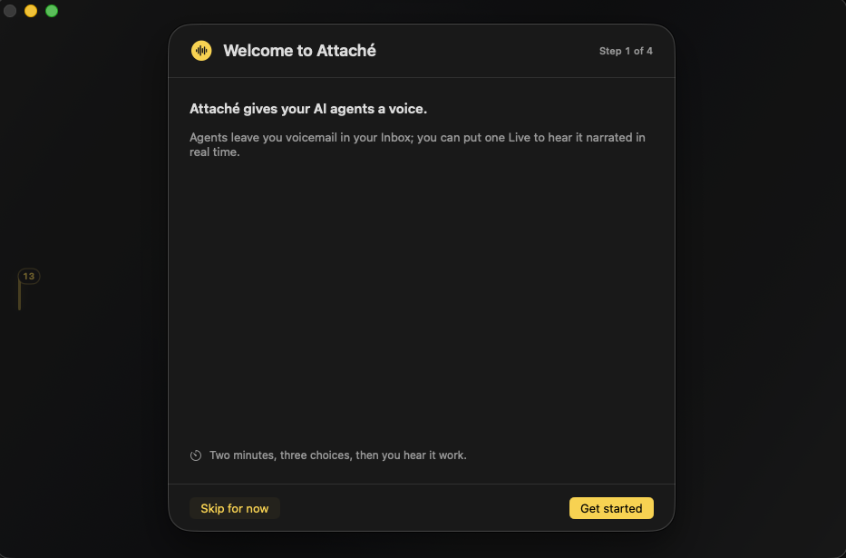

<h1 align="center">Attaché</h1>

<b>Give your agents a voice.</b>

  A native macOS app that watches the AI agents working for you and tells you
  what happened, out loud, in a voice and personality you choose. So you can
  ship the next thing instead of babysitting a terminal.

  
  
  

  <b><a href="https://attache.fm">attache.fm</a></b>

  
   
  <b><a href="https://youtu.be/oIJSxE0BFHA">▶ Watch the promo</a></b>

---

## What it does

- **Speaks every result.** When an agent finishes a turn, Attaché says what it
  did, with word-synced karaoke captions and an audio visualizer.
- **Files it like voicemail.** Every update becomes a card you can replay, skip,
  and catch up on in one pass.
- **Talks back to your agents.** Reply to any card or live turn with **Tell
  Agent** and Attaché sends your direction straight into the running session.
  Every send names its target session and asks first.
- **Interrupts only when it matters.** A real macOS notification when an agent is
  actually blocked on you. Everything else waits.
- **Recaps on demand.** Ask for a spoken recap of a session and Attaché
  summarizes it out loud, length scaled to how much happened, captions in sync.
- **Another take.** Re-narrate any card or turn in a different personality's
  voice: it reacts to the prior take, then gives its own spin. Narration only, it
  never re-sends anything to an agent.
- **Looks back.** Browse historic session summaries with a cost preview before
  you spend a token generating one.
- **Go live.** Press to start a live call: ask Attaché about a focused session,
  or switch to Tell Agent to push direction back.

It watches four agents with zero setup, speaking about sessions you pin and
letting you reply to any of them:

- [Codex CLI](https://openai.com/codex/)
- [Claude Code](https://www.anthropic.com/claude-code)
- Grok Build
- [opencode](https://opencode.ai)

## Personalities, tools, and memory

- **A personality is one unit.** Each one owns its brain (prompt and preferred
  model), its voice, its visual presence, its reasoning level, playback pace, and
  an ordered list of live-call fallback providers. Switch personalities and the
  whole loadout changes together.
- **Give it tools.** Attach MCP tools per personality with **ask-first**
  approvals, so nothing runs without your say-so. Import server definitions
  straight from your other agents' configs (Claude Code, Codex, Grok Build,
  opencode) instead of retyping them.
- **Memory you control.** Attaché saves a memory only when you ask it to
  remember something, and every memory carries its own egress setting so nothing
  leaves your Mac unless you allow it.

## Download & run

Grab the signed, notarized build. No account, no build tools.

1. Download **[Attache.dmg](https://github.com/danbryan/attache/releases/latest/download/Attache.dmg)**.
2. Open it and drag **Attaché** to your Applications folder.
3. Launch it. macOS opens it cleanly (it's notarized).

Prefer to build it yourself? `git clone` this repo and run `swift run Attache`.
No Apple certificates needed.

## Quick start

1. Finish the two-minute onboarding: choose a character, give it a personality,
   voice, model, reasoning level, and which agents it may watch.
2. Start a Codex, Claude Code, Grok Build, or opencode session, press **⌘K**,
   and pin it.
3. That's it. Every completed turn now arrives as a spoken card.

  

## Build your character

Open **Settings → Personalities** to create the character you want to spend time
with. Choose Attaché, Colt, or the Echo voice-bars presence, then give it a name,
prompt, explicit voice, model, supported reasoning level, playback pace, and
ordered fallbacks. Preview the result before you save it. Switching characters
changes the whole loadout together.

Attaché ships its own studio-quality on-device voice, **Azelma**. It is a
one-time ~113 MB download that then runs entirely on your Mac, no account and no
network needed to speak (credited under CC BY, see [THIRD-PARTY-LICENSES](THIRD-PARTY-LICENSES)).
You can also grab a free macOS Premium voice in System Settings → Accessibility →
Spoken Content → Manage Voices, or connect ElevenLabs, xAI, or OpenAI for cloud
speech. Run the character's brain locally with [Ollama](https://ollama.com), or
connect a frontier model.

## Bring your own brain and voice

Mix and match, per category:

|          | Local (private)                    | Cloud (frontier)              |
| -------- | ---------------------------------- | ----------------------------- |
| **Model** | Ollama (qwen, llama, glm, gpt-oss) | xAI, Groq, Claude, Codex, any OpenAI-compatible |
| **Voice** | Attaché Premium (Azelma), on-device macOS voices | ElevenLabs, xAI, OpenAI |

Run a local model with an on-device voice and **nothing ever leaves your Mac**.
Reach for the cloud when you want frontier quality on non-sensitive work. The
first time you pick a cloud provider, Attaché tells you exactly what gets sent
and asks for your consent. Each character saves its own voice, model, supported
reasoning level, playback pace, and ordered fallback providers.

## Privacy

- **Local-first.** Run a local model and the on-device Azelma voice and nothing
  leaves your Mac.
- **Explicit egress.** Any cloud model or voice provider is opt-in, and Attaché
  shows exactly what gets sent the first time you choose one.
- **Per-memory control.** Each durable memory carries its own egress setting.
- **Private calls.** Open the Call options and choose **Private Call**: Attaché
  keeps that call in memory only, disables memory capture and agent sends, and
  erases the temporary context at hangup. Cloud model and voice providers still
  receive what they normally receive during the call. Saved Attaché conversations
  can be permanently deleted from History.
- **No telemetry.** Attaché does not phone home with usage data.

## Back up your setup

**Settings → About → Data** keeps your local profile portable and recoverable:

- **Back Up** your personalities, history, settings, and watched sessions to a
  single file. API keys are never included; you can optionally include the
  downloaded Azelma voice.
- **Restore** from a backup and Attaché relaunches into it.
- **Reset** returns Attaché to a newly installed state, with an option to also
  remove the downloaded voice.

## Shortcuts

| Key | Does |
| --- | --- |
| **⌘K** | Find and pin sessions |
| **⌘I** | Inbox |
| **⌘Y** | History |
| **⌘L** | Start or end a live conversation |
| **S / D / R** | Playback slower, faster, reset |
| **⌘/** | All shortcuts |

## Docs

[Quick start](docs/quick-start.md) ·
[The mindset](docs/mindset.md) ·
[Context and memory](docs/context-management.md) ·
[Model integrations](docs/model-integrations.md) ·
[Third-party integrations](docs/integrations.md) ·
[Contributing personalities & themes](CONTRIBUTING.md)

## License

[Functional Source License 1.1](LICENSE.md). Use it freely for anything except
building a competing product; it converts to the MIT license two years after
each release. Builds are code-signed and notarized under Bryanlabs LLC's Apple
Developer ID.
